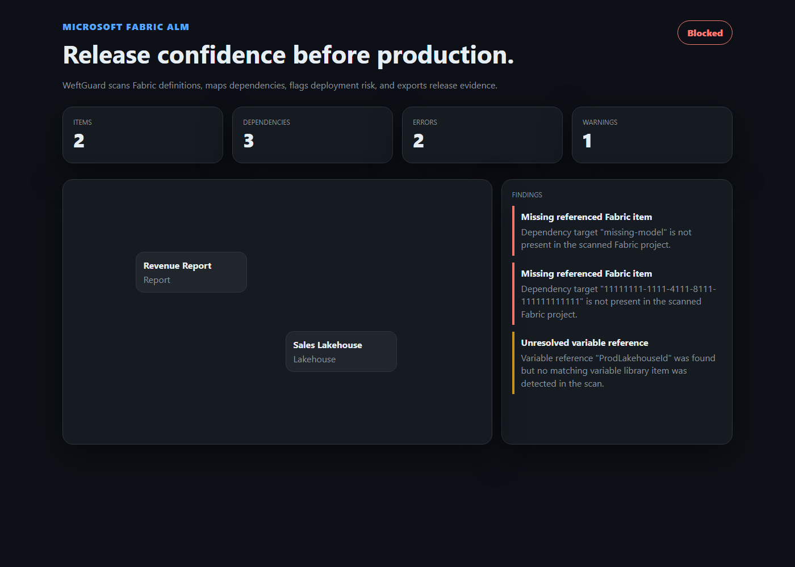

# WeftGuard

**WeftGuard** is a VS Code extension for Microsoft Fabric teams who need code-first release confidence: dependency graphs, deployment preflight checks, environment drift detection, CI/CD scaffolding, and release evidence before changes hit production.



## Features

- Local scanner for Git-connected Microsoft Fabric projects.
- Dependency graph across Fabric items, variables, environment references, and semantic model bindings.
- Deployment preflight checks for missing dependencies, hardcoded environment IDs, unresolved variables, production drift signals, and unsupported item types.
- VS Code Problems integration for release-blocking findings.
- Fabric release map tree view and polished dashboard webview.
- CI/CD starter generator for GitHub Actions.
- Release report export in Markdown and JSON.

## What it does

WeftGuard turns a local Fabric project folder into a release-readiness view:

1. It scans Fabric item definitions such as `.platform`, JSON definitions, notebooks, SQL, Python, and YAML.
2. It identifies Fabric items such as reports, semantic models, lakehouses, warehouses, notebooks, pipelines, shortcuts, and variable libraries.
3. It infers dependency edges from explicit dependency metadata, GUID-like environment references, semantic model bindings, and `${VariableName}` references.
4. It runs preflight rules for missing referenced items, hardcoded environment IDs, unresolved variables, direct-production-edit signals, and unknown item types.
5. It publishes findings to the VS Code Problems panel, renders a dashboard, and exports Markdown/JSON release reports for pull requests or change reviews.

## Evidence

The demo screenshot above was generated from a sample Fabric project containing a report with:

- a missing semantic model dependency,
- a GUID-like environment reference,
- and an unresolved `${ProdLakehouseId}` variable reference.

The generated report is checked in at [`docs/evidence/release-report-demo.md`](docs/evidence/release-report-demo.md). The same behavior is covered by unit tests in `tests/core`.

Live extension-host verification is covered by `npm run test:vscode`. That test launches VS Code/Electron, activates WeftGuard, runs the scan/preflight/export/workflow commands against `examples/demo-fabric-production`, and verifies the generated release report and CI/CD workflow files.

## Installation

Install from the VS Code Marketplace once published, or install the packaged `.vsix` locally with:

```powershell
code --install-extension .\weftguard-0.1.0.vsix
```

## Validation

```powershell
npm run build
npm run test:vscode
npm run package
```

## Usage

1. Open a folder containing Microsoft Fabric item definitions.
2. Run `WeftGuard: Scan Current Project`.
3. Run `WeftGuard: Run Deployment Preflight`.
4. Open `WeftGuard: Show Dashboard` or export a release report.

## Marketplace Metadata
- **Categories:** Other, Data Science
- **Keywords:** Microsoft Fabric, Fabric, ALM, CI/CD, deployment, governance

## Target Users
| User | Pain | WeftGuard value |
| --- | --- | --- |
| Fabric engineering lead | Needs repeatable release quality across workspaces | Preflight checks, dependency impact analysis, deployment reports |
| BI platform owner | Needs governance without slowing teams | Rules, drift detection, capacity and environment warnings |
| Analytics consultant | Needs to ship Fabric solutions across clients | Reusable project templates, CI/CD generation, customer-ready reports |
| Enterprise developer | Wants local dev ergonomics | VS Code commands, tree views, diffs, and problem diagnostics |

## Changelog
See [CHANGELOG.md](CHANGELOG.md) for release notes.

## License
[MIT](LICENSE)

---

> The name is intentional: in woven fabric, the **weft** is the cross-thread that binds the material together. WeftGuard protects the cross-workspace, cross-environment threads that hold a Fabric estate together before deployment.
